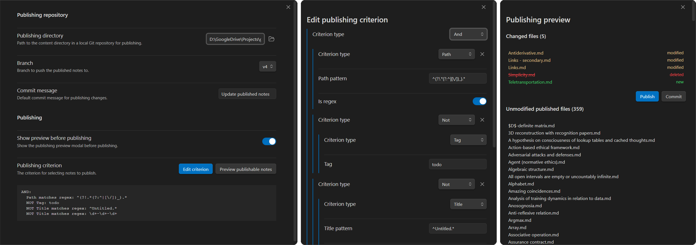

# Selective Publisher for Obsidian

A plugin for Obsidian that selectively publishes notes to a Git repository based on customizable criteria.

## Features

- Filtering of notes and attachemnts based on tags, frontmatter, path, or content, and path-based filtering of other files.
- Committing and pushing to a target Git repository.
- Review of changed files (added, modified, deleted) before publishing.

## Requirements

- Obsidian v0.15.0+
- Git installed and configured locally.
- A local clone of target remote repository. The repository can contain static site generation workflows such as [Quartz v4](https://github.com/jackyzha0/quartz).

## Installation

1. Search for "Selective Publisher" in Obsidian's Community Plugins.
2. Click "Install" and then "Enable".

## Setup

1. Clone your target repository (e.g., GitHub Pages) to a local folder.
2. In the plugin settings:
   - Set "Publishing directory" to the local clone's absolute path or a directory within it.
   - Optionally, change the "Publishing branch" (e.g., `main`).
   - Configure "Publishing criterion" (see below).
   - Optionally, uncheck "Show preview before publishing" to skip the preview modal when publishing.

## Usage

### Publishing criterion

The plugin evaluates each markdown file against a tree combining criteria:
- **Tag**: Matches exact Obsidian tag or hierarchical subtags (e.g., `public` matches `#public/blog`).
- **Frontmatter**: Matches a specific key and value in YAML frontmatter, with support for regex in the value field.
- **Folder**: Includes or excludes specific directories.
- **Title**: Matches the file basename (without extension). Supports substring or regex.
- **Path**: Matches the relative path from vault root. Supports substring or regex.
- **Content**: Matches body text based on a regex search.

Criteria can be combined with logical operators: **AND**, **OR**, and **NOT**.

### Publishing

There are two ways to publish notes:
- Click the ribbon button with a paper plane icon. By default, this opens a preview modal before publishing.
- Run the command `Publish notes`. This publishes the changes.

The preview modal displays the matching files and their status (new, modified, deleted, unmodified) relative to the target repository.

You can choose to publish (commit and push) or just commit (local only).

### Commands

- **Publish notes**: Publish all matching notes. Shows preview first if enabled in settings.
- **Preview publishable files**: Preview files that match the criteria with their status (new, modified, deleted, unmodified).
- **Ribbon button** (paper plane icon): Quick shortcut to publish notes.

## Other information

- All Git operations are executed locally. No data is sent to external servers except via the Git remote.
- AI agents used in development: Claude 3.7, GPT-4o, Claude 4.5 Opus, Gemini 3 Flash, Gemini 3 Pro, Claude 4.5 Haiku, GPT-5.2, Claude 4.5 Opus.

## Related projects

- [Enveloppe](https://github.com/Enveloppe/obsidian-enveloppe)
   - Publishes via the GitHub API.
   - Doesn't require Git and a local repository.
   - Has more features and options, including processing of links and dataviews.
